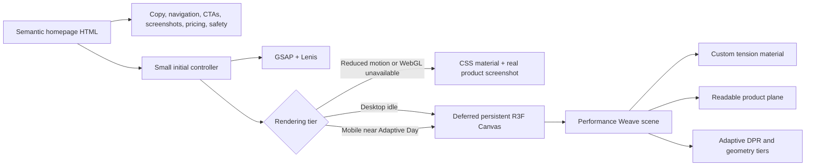
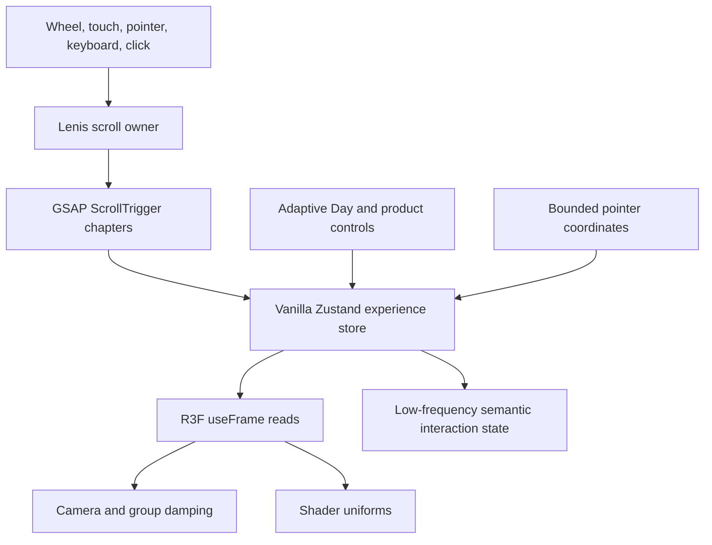
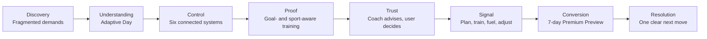
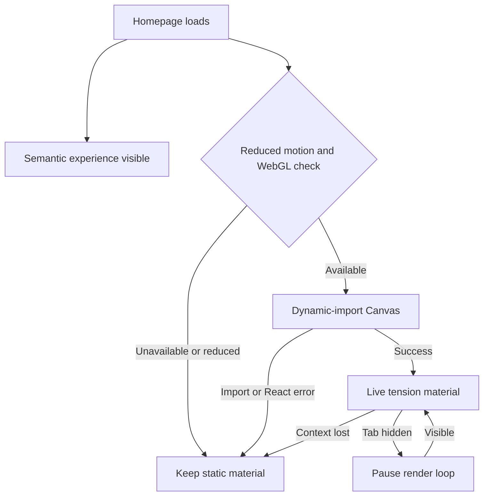

# Immersive Homepage Architecture

## Rendering model



Essential information never depends on React or WebGL. The Canvas is fixed behind the semantic story and remains mounted across the homepage instead of recreating one renderer per section.

## State and timeline flow



High-frequency values never move through React component state. React re-renders only for low-frequency changes such as the selected product texture, viewport tier, visibility, or DPR tier.

## Homepage chapters



## Source layout

```text
experience-src/
  main.jsx                         deferred-tier bootstrap
  experience.css                  production visual and responsive system
  motion/
    initMotion.js                 Lenis, GSAP, DOM interactions, CTA event
  shaders/
    tensionMaterial.js            custom vertex and fragment shaders
  store/
    experienceStore.js            vanilla, revision-free visual state only
  webgl/
    ExperienceCanvas.jsx          persistent Canvas, quality, fallback hooks
    PerformanceWeave.jsx          scene, camera, geometry, product planes
```

## Failure behavior



The fallback includes the real Today product screen, the system seam, semantic copy, the adaptive-day control, and all conversion paths. There is no blank-screen failure mode.
